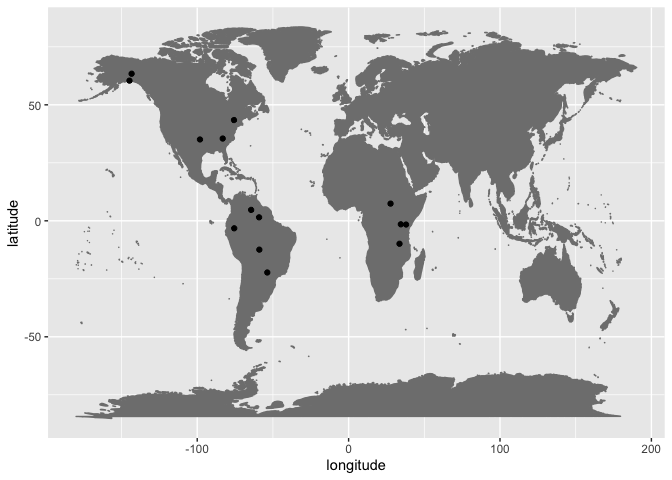
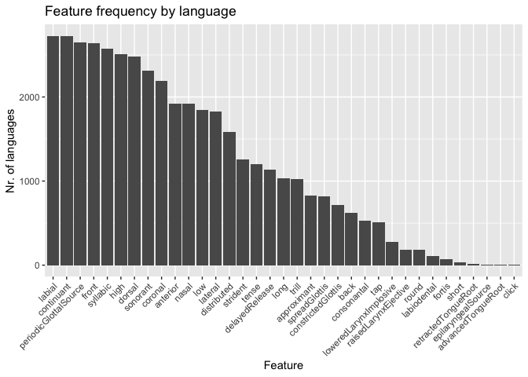
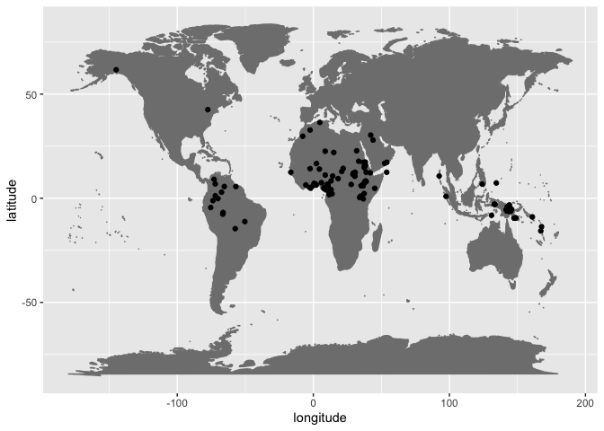
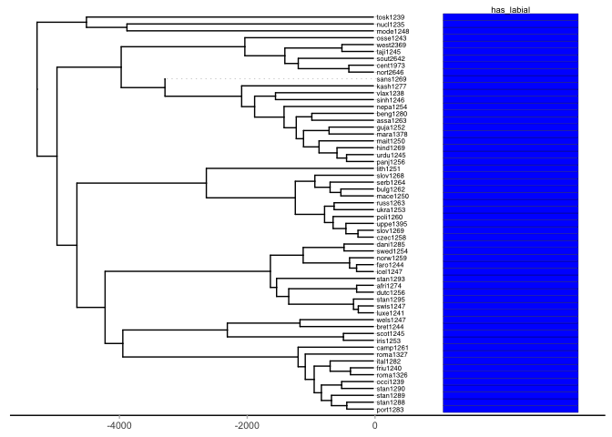
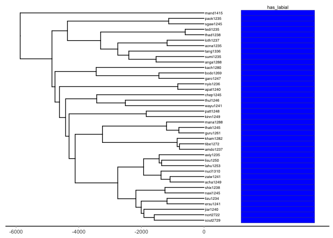

Supplementary materials: Life of p
================
Steven Moran and Adriano Lameira
(01 December, 2022)

-   <a href="#overview" id="toc-overview">Overview</a>
-   <a href="#analyses" id="toc-analyses">Analyses</a>
    -   <a href="#modern-cross-linguistic-segment-frequencies"
        id="toc-modern-cross-linguistic-segment-frequencies">Modern
        cross-linguistic segment frequencies</a>
    -   <a href="#the-feature-labial" id="toc-the-feature-labial">The feature
        labial</a>
    -   <a href="#labials-in-ancient-and-reconstructed-languages"
        id="toc-labials-in-ancient-and-reconstructed-languages">Labials in
        ancient and reconstructed languages</a>
    -   <a href="#labials-from-a-diachronic-perspective"
        id="toc-labials-from-a-diachronic-perspective">Labials from a diachronic
        perspective</a>
-   <a href="#exploratory" id="toc-exploratory">Exploratory</a>
-   <a href="#borrowability" id="toc-borrowability">Borrowability</a>
-   <a href="#references" id="toc-references">References</a>

# Overview

This supplementary materials for the manuscript “Life of p” uses the R
programming language (R Core Team 2021) and the following R libraries
(Wickham et al. 2019; Xie 2021; Revell 2012; J. Zhang 2017; Yu 2020;
Wickham 2011).

``` r
library(tidyverse)
library(knitr)
library(phytools)
library(phylotools)
library(ggtree)
library(testthat)
```

In what follows, we undertake several analyses including:

-   investigating the cross-linguistic frequency of labial segments
    including /p/ and /b/ in a large sample of the world’s languages
-   examining how common the contrastive feature labial is in the
    documented phonological inventories of the world
-   identifying the presence of labial segments in ancient and
    reconstructed languages
-   looking at labials in language families from a diachronic
    perspective, i.e., investigating whether they are prominent or not
    within large language families for which we have robust
    computational phylogenetics data

# Analyses

## Modern cross-linguistic segment frequencies

For cross-linguistic analyses of segment frequencies, we combine the
PHOIBLE sample of phonological inventories (Moran and McCloy 2019) and
append to them the linguistic and non-linguistic metadata data
associated with the Glottolog, a catalog of the world’s languages
(Hammarström et al. 2020).

``` r
phoible <- read_csv(url("https://github.com/phoible/dev/blob/646f5e4f64bfefb7868bf4a3b65bcd1da243976a/data/phoible.csv?raw=true"),
  col_types = c(InventoryID = "i", Marginal = "l", .default = "c")
)

glottolog <- read_csv(url("https://cdstar.shh.mpg.de/bitstreams/EAEA0-E62D-ED67-FD05-0/languages_and_dialects_geo.csv"))

phoible <- left_join(phoible, glottolog, by = c("Glottocode" = "glottocode"))
```

The data look like this.

``` r
phoible %>%
  head() %>%
  kable()
```

| InventoryID | Glottocode | ISO6393 | LanguageName | SpecificDialect | GlyphID   | Phoneme | Allophones | Marginal | SegmentClass | Source | tone | stress | syllabic | short | long | consonantal | sonorant | continuant | delayedRelease | approximant | tap | trill | nasal | lateral | labial | round | labiodental | coronal | anterior | distributed | strident | dorsal | high | low | front | back | tense | retractedTongueRoot | advancedTongueRoot | periodicGlottalSource | epilaryngealSource | spreadGlottis | constrictedGlottis | fortis | raisedLarynxEjective | loweredLarynxImplosive | click | name   | isocodes | level    | macroarea | latitude | longitude |
|------------:|:-----------|:--------|:-------------|:----------------|:----------|:--------|:-----------|:---------|:-------------|:-------|:-----|:-------|:---------|:------|:-----|:------------|:---------|:-----------|:---------------|:------------|:----|:------|:------|:--------|:-------|:------|:------------|:--------|:---------|:------------|:---------|:-------|:-----|:----|:------|:-----|:------|:--------------------|:-------------------|:----------------------|:-------------------|:--------------|:-------------------|:-------|:---------------------|:-----------------------|:------|:-------|:---------|:---------|:----------|---------:|----------:|
|           1 | kore1280   | kor     | Korean       | NA              | 0068      | h       | ç h ɦ      | NA       | consonant    | spa    | 0    | \-     | \-       | \-    | \-   | \-          | \-       | \+         | \+             | \-          | \-  | \-    | \-    | \-      | \-     | 0     | 0           | \-      | 0        | 0           | 0        | \-     | 0    | 0   | 0     | 0    | 0     | 0                   | 0                  | \-                    | \-                 | \+            | \-                 | \-     | \-                   | \-                     | \-    | Korean | kor      | language | Eurasia   |     37.5 |       128 |
|           1 | kore1280   | kor     | Korean       | NA              | 006A      | j       | j          | NA       | consonant    | spa    | 0    | \-     | \-       | \-    | \-   | \-          | \+       | \+         | 0              | \+          | \-  | \-    | \-    | \-      | \-     | 0     | 0           | \-      | 0        | 0           | 0        | \+     | \+   | \-  | \+    | \-   | \+    | 0                   | 0                  | \+                    | \-                 | \-            | \-                 | \-     | \-                   | \-                     | \-    | Korean | kor      | language | Eurasia   |     37.5 |       128 |
|           1 | kore1280   | kor     | Korean       | NA              | 006B      | k       | k̚ ɡ k      | NA       | consonant    | spa    | 0    | \-     | \-       | \-    | \-   | \+          | \-       | \-         | \-             | \-          | \-  | \-    | \-    | \-      | \-     | 0     | 0           | \-      | 0        | 0           | 0        | \+     | \+   | \-  | \-    | \-   | 0     | 0                   | 0                  | \-                    | \-                 | \-            | \-                 | \-     | \-                   | \-                     | \-    | Korean | kor      | language | Eurasia   |     37.5 |       128 |
|           1 | kore1280   | kor     | Korean       | NA              | 006B+02B0 | kʰ      | kʰ         | NA       | consonant    | spa    | 0    | \-     | \-       | \-    | \-   | \+          | \-       | \-         | \-             | \-          | \-  | \-    | \-    | \-      | \-     | 0     | 0           | \-      | 0        | 0           | 0        | \+     | \+   | \-  | \-    | \-   | 0     | 0                   | 0                  | \-                    | \-                 | \+            | \-                 | \-     | \-                   | \-                     | \-    | Korean | kor      | language | Eurasia   |     37.5 |       128 |
|           1 | kore1280   | kor     | Korean       | NA              | 006B+02C0 | kˀ      | kˀ         | NA       | consonant    | spa    | 0    | \-     | \-       | \-    | \-   | \+          | \-       | \-         | \-             | \-          | \-  | \-    | \-    | \-      | \-     | 0     | 0           | \-      | 0        | 0           | 0        | \+     | \+   | \-  | \-    | \-   | 0     | 0                   | 0                  | \-                    | \-                 | \-            | \+                 | \-     | \-                   | \-                     | \-    | Korean | kor      | language | Eurasia   |     37.5 |       128 |
|           1 | kore1280   | kor     | Korean       | NA              | 006C      | l       | ɾ l lʲ     | NA       | consonant    | spa    | 0    | \-     | \-       | \-    | \-   | \+          | \+       | \+         | 0              | \+          | \-  | \-    | \-    | \+      | \-     | 0     | 0           | \+      | \+       | \-          | \-       | \-     | 0    | 0   | 0     | 0    | 0     | 0                   | 0                  | \+                    | \-                 | \-            | \-                 | \-     | \-                   | \-                     | \-    | Korean | kor      | language | Eurasia   |     37.5 |       128 |

How many inventories (data points) are there in PHOIBLE?

``` r
nrow(phoible %>% select(InventoryID) %>% distinct())
```

    ## [1] 3020

How many languages (defined as distinct [ISO
639-3](https://iso639-3.sil.org) language identifiers) are there?

``` r
nrow(phoible %>% select(ISO6393) %>% distinct())
```

    ## [1] 2093

How many segment types are there?

``` r
nrow(phoible %>% select(Phoneme) %>% distinct())
```

    ## [1] 3169

Get all rows with phonemes that are voiceless bilabial plosive, i.e.,
“p” like.

``` r
df <- phoible %>% filter(grepl("p", Phoneme))
```

What are they?

``` r
ps <- df %>%
  select(Phoneme) %>%
  distinct()
ps <- df %>%
  select(Phoneme) %>%
  group_by(Phoneme) %>%
  summarize(count = n()) %>%
  arrange(desc(count))
head(ps) %>% kable()
```

| Phoneme | count |
|:--------|------:|
| p       |  2594 |
| pʰ      |   592 |
| kp      |   373 |
| pʼ      |   178 |
| p͉       |    79 |
| p͈       |    72 |

``` r
# write_csv(ps, 'ps.csv')
```

Some of the “p-like” segments include labiovelars like /kp/. Let’s drop
those.

``` r
ps <- ps %>% filter(!(grepl("kp|pf|mp", Phoneme)))
```

Since PHOIBLE may have multiple analyses for the same language variety
(see explanation regarding so-called “doculects” in the [PHOIBLE
FAQ](https://phoible.org/faq#inventories-language-codes-doculects-and-sources)),
we combine the phonological inventories from multiple sources into
single entries so that we can examine which languages have been reported
to have certain segments or not.

``` r
phoible_by_iso <- phoible %>%
  select(ISO6393, Phoneme) %>%
  group_by(ISO6393) %>%
  distinct()
```

Since the ISO 6393 code `mis` is for languages that are missing a
language name identifier, we drop those.

``` r
phoible_by_iso <- phoible_by_iso %>% filter(ISO6393 != "mis")
```

How many distinct languages are left once they have been aggregated by
ISO 639-3 code?

``` r
num_languages <- nrow(phoible_by_iso %>% distinct(ISO6393))
num_languages
```

    ## [1] 2092

Now we select from these languages which have a p-like segment.

``` r
phoible_by_iso_with_p <- phoible_by_iso %>% filter(Phoneme %in% ps$Phoneme)
phoible_by_iso_with_p %>%
  head() %>%
  kable()
```

| ISO6393 | Phoneme |
|:--------|:--------|
| kor     | p       |
| kor     | pʰ      |
| kor     | pˀ      |
| lbe     | pʰ      |
| lbe     | pʼ      |
| lbe     | p͈       |

We summarize their counts.

``` r
phoible_by_iso_with_p %>%
  group_by(ISO6393) %>%
  summarize(n = n()) %>%
  arrange(desc(n))
```

    ## # A tibble: 1,949 × 2
    ##    ISO6393     n
    ##    <chr>   <int>
    ##  1 lez         6
    ##  2 sjd         6
    ##  3 bcq         5
    ##  4 gle         5
    ##  5 lbe         5
    ##  6 yey         5
    ##  7 acn         4
    ##  8 ahk         4
    ##  9 alw         4
    ## 10 amh         4
    ## # … with 1,939 more rows

And ask what percentage of languages in PHOIBLE have p-like sounds.

``` r
nrow(phoible_by_iso_with_p %>% select(ISO6393) %>% distinct()) / num_languages
```

    ## [1] 0.9316444

Which are the languages that contain no “p-like” segments?

``` r
phoible_by_iso_no_p <- phoible_by_iso %>%
  filter(!(ISO6393 %in% phoible_by_iso_with_p$ISO6393)) %>%
  select(ISO6393) %>%
  distinct() %>%
  arrange(ISO6393)

phoible_by_iso_no_p %>%
  head() %>%
  kable()
```

| ISO6393 |
|:--------|
| aar     |
| aey     |
| aft     |
| aha     |
| aht     |
| aiw     |

There are quite a few languages without “p-like” segments.

``` r
nrow(phoible_by_iso_no_p)
```

    ## [1] 143

Or about 7% of languages in the sample (see above).

``` r
nrow(phoible_by_iso_no_p) / num_languages
```

    ## [1] 0.06835564

One random example is
[Afar](https://phoible.org/inventories/view/1342#tipa), which does not
contain a voiceless bilabial plosive, but it does contain its voiced
counterpart “b”. Another is
[Somali](https://phoible.org/inventories/view/552#tipa) with the same
segment configuration within the bilabial plosives. Both languages are
also in Africa.

Let’s look geographically at which languages lack voiceless bilabial
plosives.

``` r
no_p_by_geography <- phoible %>%
  filter(ISO6393 %in% phoible_by_iso_no_p$ISO6393) %>%
  select(ISO6393, latitude, longitude, macroarea) %>%
  distinct() %>%
  arrange(ISO6393)
```

How do these language points look on a map? There are no data points in
Eurasia nor Australia, but many in Oceania, Africa, and South America.

``` r
ggplot(data = no_p_by_geography, aes(x = longitude, y = latitude)) +
  borders("world", colour = "gray50", fill = "gray50") +
  geom_point()
```

<!-- -->

Africa is notable for lacking voiceless bilabial plosives (Houis 1974;
Maddieson 1984; Clements and Rialland 2008) and is interesting because
within a relatively broad sample of phonological segment borrowings /p/
is the most frequently borrowed speech sound (Grossman et al. 2020). In
other words, /p/ seems to have been lost in certain linguistic areas,
probably due to regular processes of sound change, but then is easily
re-introduced into languages via borrowing, e.g., Tem (Central Gur,
Togo), Tigrinya (Semitic, Ethiopia), or !Xóõ (Tuu, Botswana and Namibia)
(Clements and Rialland 2008). (Similar observations about
cross-linguistically frequently segments missing in certain world areas,
which were perhaps lost at some point in the past and this loss then
inherited by daughter languages and dialects, is reported by Moran,
Lester, and Grossman (2021)).

So of the languages that lack /p/, how many also lack /b/?

``` r
tmp <- phoible_by_iso %>% filter(ISO6393 %in% phoible_by_iso_no_p$ISO6393)
tmp <- tmp %>% filter(grepl("b", Phoneme))
tmp <- tmp %>% filter(!grepl("ɡb", Phoneme)) # Let's drop labial velars
tmp <- tmp %>%
  select(ISO6393) %>%
  distinct() %>%
  arrange(ISO6393)
tmp <- phoible_by_iso_no_p %>% filter(!(ISO6393 %in% tmp$ISO6393))
tmp %>% kable()
```

| ISO6393 |
|:--------|
| bvi     |
| chr     |
| eya     |
| kam     |
| kuj     |
| mch     |
| ndh     |
| one     |
| opy     |
| tcb     |
| trr     |
| unk     |
| waw     |
| wic     |
| wya     |

Where are they spoken?

``` r
no_bilabials <- phoible %>%
  filter(ISO6393 %in% tmp$ISO6393) %>%
  select(ISO6393, latitude, longitude, macroarea) %>%
  distinct() %>%
  arrange(macroarea)
no_bilabials %>% kable()
```

| ISO6393 |  latitude |  longitude | macroarea     |
|:--------|----------:|-----------:|:--------------|
| kuj     |  -1.50636 |   34.50490 | Africa        |
| bvi     |   7.41311 |   27.69560 | Africa        |
| kam     |  -1.60827 |   37.95320 | Africa        |
| ndh     |  -9.88948 |   33.61180 | Africa        |
| wic     |  35.06650 |  -98.18310 | North America |
| one     |  43.43874 |  -75.70811 | North America |
| chr     |  35.46640 |  -83.16300 | North America |
| eya     |  60.42320 | -144.76200 | North America |
| wya     |        NA |         NA | North America |
| tcb     |  63.40460 | -143.33800 | North America |
| unk     | -12.43020 |  -58.98020 | South America |
| mch     |   4.70705 |  -64.38770 | South America |
| waw     |   1.50881 |  -59.14170 | South America |
| trr     |  -3.22497 |  -75.56030 | South America |
| opy     | -22.27800 |  -53.72270 | South America |

They are mainly found in the Americas.

``` r
ggplot(data = no_bilabials, aes(x = longitude, y = latitude)) +
  borders("world", colour = "gray50", fill = "gray50") +
  geom_point()
```

<!-- -->

Languages lacking native bilabial plosives /p/ and /b/ are extremely
rare in the PHOIBLE sample overall, i.e. 14 observations out of 2092
languages (0.007%). They include North American languages like Cherokee
and Eyak that lack labials except the nasal /m/, which is reportedly
rare or only occur in loanwords:

-   <https://phoible.org/inventories/view/280#tipa>
-   <https://phoible.org/inventories/view/325#tipa>

And Wichita with a cross-linguistically unusual phonology that lacks
pure labials (e.g., /p/, /b/, and /m/), although it has the voiced
labial-velar approximant /w/ and the labiovelar /kʷ/.

-   <https://phoible.org/inventories/view/611#tipa>

In East Africa, the languages include Kikamba, Kuria, Chindali,
respectively:

-   <https://phoible.org/inventories/view/1443#tipa>
-   <https://phoible.org/inventories/view/758#tipa>
-   <https://phoible.org/inventories/view/1471#tipa>

Kikamba and Kuria both have a phonemic voiced bilabial fricative /β/ and
bilabial nasal /m/. Chindali has /m/, but lacks the voiceless and voiced
plosive – although it has the rare labiodental approximant /ʋ/.

The languages reported in South America, Enawené-Nawé, Yekwana, Waiwai,
Taushiro, Ofayé, all contain /w/, and /m/, /β/, or /kʷ/ to various
extents.

-   <https://phoible.org/inventories/view/1818#tipa>
-   <https://phoible.org/inventories/view/1879#tipa>
-   <https://phoible.org/inventories/view/1886#tipa>
-   <https://phoible.org/inventories/view/1936#tipa>
-   <https://phoible.org/inventories/view/1968#tipa>

Thus, even when languages lack pure /p/ and /b/, there tends to me to
some extent the phonological feature labial still present in the
phonological inventory.

What about languages with no labial sounds at all? First let’s get all
the languages with labials.

``` r
labials <- phoible %>%
  select(ISO6393, Phoneme) %>%
  filter(grepl("p|b|m|ɸ|β|ʙ", Phoneme)) %>%
  distinct()

phoible_by_iso_no_labials <- phoible_by_iso %>%
  filter(!(ISO6393 %in% labials$ISO6393)) %>%
  select(ISO6393) %>%
  distinct() %>%
  arrange(ISO6393)
```

There are five languages in the total sample that purportedly have no
kind of labial, /w/ notwithstanding.

``` r
phoible_by_iso_no_labials %>% kable()
```

| ISO6393 |
|:--------|
| one     |
| opy     |
| trr     |
| wic     |
| wya     |

-   <https://phoible.org/inventories/view/77#tipa>
-   <https://phoible.org/inventories/view/1968#tipa>
-   <https://phoible.org/inventories/view/1936#tipa>
-   <https://phoible.org/inventories/view/74#tipa>
-   <https://phoible.org/inventories/view/611#tipa>
-   <https://phoible.org/inventories/view/885#tipa>

Of the five languages (and six doculects) listed above, only Oneida does
not list the voiced labial-velar approximant /w/ as contrastive.
[Oneida](https://en.wikipedia.org/wiki/Oneida_language#Phonology) is
noted as being exceptional because it lacks bilabial consonants and
labiodental fricatives. However, Oneida reportedly has /w/ and
labialized /kw/ (Michelson 1990; Abbott 2006) and even in the source
above in phoible (Lounsbury 1953), it is noted that many speakers use
the voiceless bilabial fricative or other bilabial or labiodental
articulations instead of the voiced velar approximant.

## The feature labial

How common is the phonological feature labial in the phonological
inventories of the world’s documented languages? The segment data in
PHOIBLE contain information about their phonetic properties. For example
the bilabial consonants:

``` r
phoible %>%
  select(Phoneme, SegmentClass, consonantal, labial, periodicGlottalSource, delayedRelease, nasal) %>%
  filter(Phoneme %in% c("p", "b", "m", "ɸ", "β", "ʙ")) %>%
  distinct() %>%
  kable()
```

| Phoneme | SegmentClass | consonantal | labial | periodicGlottalSource | delayedRelease | nasal |
|:--------|:-------------|:------------|:-------|:----------------------|:---------------|:------|
| m       | consonant    | \+          | \+     | \+                    | 0              | \+    |
| p       | consonant    | \+          | \+     | \-                    | \-             | \-    |
| b       | consonant    | \+          | \+     | \+                    | \-             | \-    |
| β       | consonant    | \+          | \+     | \+                    | \+             | \-    |
| ɸ       | consonant    | \+          | \+     | \-                    | \+             | \-    |
| ʙ       | consonant    | \+          | \+     | \+                    | 0              | \-    |

A phonological inventory can be described in terms of these contrastive
phonetic features by identifying which features are needed to
contrastively encode all of the segments within the language. For
example in the table above, if a language contains /p/ and /b/, we can
consider `periodicGlottalSource` necessary for encoding the phonological
distinction between the words ‘pad’ and ‘bad’, which only differ in
terms of the voicing, i.e., vocal chord vibration.

In other work, we have developed an algorithm for identifying which
phonological features are needed to encode each language’s segments.

``` r
load("../the_role_of_features/scripts/new_answers.RData")
```

``` r
# The data is a list of matrices in R, so we flatten those and then summarize their presence and plot the results.
features <- lapply(new_answers, function(x) unique(as.vector((x))))
features <- features %>%
  enframe() %>%
  unnest(value)
features <- unnest(features, value) %>% arrange(name, value) # save this for later processing
cross_features <- features %>%
  group_by(name, value) %>%
  summarize(total = n())
cross_features <- cross_features %>%
  group_by(value) %>%
  summarize(total = n()) %>%
  arrange(desc(total))
head(cross_features)
```

    ## # A tibble: 6 × 2
    ##   value                 total
    ##   <chr>                 <int>
    ## 1 labial                 2728
    ## 2 continuant             2720
    ## 3 periodicGlottalSource  2652
    ## 4 front                  2640
    ## 5 syllabic               2572
    ## 6 high                   2511

There are this many inventories represented in the data set:

``` r
length(new_answers)
```

    ## [1] 2759

This plot shows that the features labial and continuant (i.e. the set of
sounds that are not stops or affricates) are the most common in
languages cross-linguistically. The feature periodic glottal source, aka
voice, is third.

``` r
ggplot(cross_features, aes(reorder(x = value, -total), y = total)) +
  geom_bar(stat = "identity") +
  theme(axis.text.x = element_text(angle = 45, hjust = 1)) +
  labs(x = "Feature", y = "Nr. of languages") +
  ggtitle("Feature frequency by language")
```

<!-- -->

Most languages employ the phonological feature `labial` to encode
contrastive sounds in their language.

Because we want to know which languages employ the phonological feature
labial in our phylogenetic analysis below, we first create a table with
those values.

``` r
labial_features <- features %>% filter(value == "labial")
traits <- phoible %>%
  select(InventoryID, Glottocode) %>%
  distinct()
traits <- left_join(traits, labial_features, by = c("InventoryID" = "name"))

traits <- traits %>% mutate(value = replace(value, is.na(value), "N"))
traits <- traits %>% mutate(value = replace(value, value == "labial", "Y"))

traits <- traits %>% select(-InventoryID)
traits <- traits %>% rename(taxa = Glottocode, has_labial = value)

# Remove the NA glottocodes in phoible
traits <- traits %>% filter(!is.na(taxa))

# There are a handful of dimensionality reduction results that do not agree
# tmp <- traits %>% group_by(taxa) %>% summarize(labials = paste(labial, collapse = ','))
# tmp %>% filter(grepl("T,F", labials))
# tmp %>% filter(grepl("F,T", labials))

# For now we just take the first result and discard the rest
traits <- traits %>%
  group_by(taxa) %>%
  slice_head() %>%
  ungroup()

# Sometimes... just (a)R(rgh)
traits <- as.data.frame(traits)
rownames(traits) <- NULL
rownames(traits) <- traits[, 1]
```

## Labials in ancient and reconstructed languages

First let’s have a look at data that exist for ancient and reconstructed
languages. For example, we have seen that missing (bi)labials include
areal features, for example, in Africa. What percentage of languages
lack /p/ but contain /b/?

``` r
phoible_by_iso_with_b <- phoible %>% filter(grepl("b", Phoneme))
phoible_by_iso_with_b <- phoible_by_iso_with_b %>% filter(!(ISO6393 == "mis"))
phoible_by_iso_with_b <- phoible_by_iso_with_b %>% filter(!grepl("ɡb", Phoneme)) # Let's drop labial velars
phoible_by_iso_with_b <- phoible_by_iso_with_b %>%
  select(ISO6393) %>%
  distinct() %>%
  arrange(ISO6393)

with_p <- phoible_by_iso_with_p %>%
  select(ISO6393) %>%
  distinct()
with_p$has_p <- TRUE

with_b <- phoible_by_iso_with_b %>%
  select(ISO6393) %>%
  distinct()
with_b$has_b <- TRUE

results <- full_join(with_p, with_b)
results <- results %>% filter(is.na(has_p) & has_b)
```

So, roughly 6% of languages in the PHOIBLE sample contain a voiced
bilabial plosive, but lack its voiceless counterpart.

``` r
nrow(results) / num_languages
```

    ## [1] 0.06118547

Where are they spoken?

``` r
b_but_no_p <- phoible %>%
  filter(ISO6393 %in% results$ISO6393) %>%
  select(ISO6393, latitude, longitude, macroarea) %>%
  distinct() %>%
  arrange(macroarea)
```

``` r
ggplot(data = b_but_no_p, aes(x = longitude, y = latitude)) +
  borders("world", colour = "gray50", fill = "gray50") +
  geom_point()
```

<!-- -->

Mainly in Africa, in which this phenomenon has also been noted as a
feature north of the equator and in the Arabian peninsula. It is also
known that Arabic lost its /p/ in prehistoric times, but it is unclear
whether the lack of /p/ in these areas is due to Arabic’s influence as a
prestige language or whether the effect itself is even more ancient.

Hence, one interesting area to investigate the cross-linguistic
frequency of labial sounds is in ancient and reconstruction languages of
the world. BDPROTO is a database of phonological inventories from
ancient and reconstructed languages (Marsico et al. 2018; Moran,
Grossman, and Verkerk 2020). We can evaluate these (proto) languages for
the presence or absence of bilabials in ancient times.

``` r
bdproto <- read_csv(url("https://raw.githubusercontent.com/bdproto/bdproto/master/bdproto.csv"))
num_languages_bdproto <- bdproto %>%
  select(BdprotoID) %>%
  distinct()
```

We note that by using BDPROTO phonological inventory IDs we count
different reconstructions of the same proto-language in several cases
and that some of the proto-languages are embedded within higher order
language families, e.g. Germanic within Indo-European. For issues
regarding so-called temporal bias, refer to Moran, Grossman, and Verkerk
(2020) and Moran, Lester, and Grossman (2021).

``` r
bdproto <- bdproto %>% filter(!(is.na(BdprotoID)))

bdproto_with_b <- bdproto %>% filter(grepl("b", Phoneme))
bdproto_with_b <- bdproto_with_b %>% filter(!grepl("ɡb|mb", Phoneme))
bdproto_with_b %>%
  select(Phoneme) %>%
  distinct()
```

    ## # A tibble: 9 × 1
    ##   Phoneme
    ##   <chr>  
    ## 1 b      
    ## 2 bʰ     
    ## 3 ˀb     
    ## 4 b̥      
    ## 5 bː     
    ## 6 b̤ʰ     
    ## 7 bʲ     
    ## 8 bʷ     
    ## 9 bʼ

``` r
bdproto_with_b <- bdproto_with_b %>%
  select(BdprotoID) %>%
  distinct() %>%
  arrange(BdprotoID)
bdproto_with_b$has_b <- TRUE

bdproto_with_p <- bdproto %>% filter(grepl("p", Phoneme))
bdproto_with_p <- bdproto_with_p %>% filter(!grepl("kp|mp", Phoneme))
bdproto_with_p %>%
  select(Phoneme) %>%
  distinct()
```

    ## # A tibble: 13 × 1
    ##    Phoneme
    ##    <chr>  
    ##  1 p      
    ##  2 pʼ     
    ##  3 pʰ     
    ##  4 pː     
    ##  5 pʷ     
    ##  6 pːʷ    
    ##  7 pˀ     
    ##  8 pʲ     
    ##  9 ʰp     
    ## 10 pl     
    ## 11 pr     
    ## 12 p̰      
    ## 13 ˀp

``` r
bdproto_with_p <- bdproto_with_p %>%
  select(BdprotoID) %>%
  distinct() %>%
  arrange(BdprotoID)
bdproto_with_p$has_p <- TRUE

bdproto_results <- full_join(bdproto_with_p, bdproto_with_b)
```

Which ancient and reconstructed languages lack labial plosives /p/ and
/b/? None.

``` r
bdproto_results %>% filter(is.na(has_p) & is.na(has_b))
```

    ## # A tibble: 0 × 3
    ## # … with 3 variables: BdprotoID <dbl>, has_p <lgl>, has_b <lgl>

Which lack a /p/? 15 out of 253 data points, so around 8%.

``` r
bdproto_results %>% filter(is.na(has_p))
```

    ## # A tibble: 19 × 3
    ##    BdprotoID has_p has_b
    ##        <dbl> <lgl> <lgl>
    ##  1         5 NA    TRUE 
    ##  2         8 NA    TRUE 
    ##  3        31 NA    TRUE 
    ##  4        71 NA    TRUE 
    ##  5       159 NA    TRUE 
    ##  6       166 NA    TRUE 
    ##  7       184 NA    TRUE 
    ##  8       185 NA    TRUE 
    ##  9       186 NA    TRUE 
    ## 10       190 NA    TRUE 
    ## 11      1014 NA    TRUE 
    ## 12      1023 NA    TRUE 
    ## 13      1025 NA    TRUE 
    ## 14      1032 NA    TRUE 
    ## 15      1039 NA    TRUE 
    ## 16      1059 NA    TRUE 
    ## 17      1081 NA    TRUE 
    ## 18      2002 NA    TRUE 
    ## 19      2015 NA    TRUE

Which lack a /b/? Quite a few more – 94 out of 253 data points, so
around 37%.

``` r
bdproto_results %>% filter(is.na(has_b))
```

    ## # A tibble: 93 × 3
    ##    BdprotoID has_p has_b
    ##        <dbl> <lgl> <lgl>
    ##  1        10 TRUE  NA   
    ##  2        20 TRUE  NA   
    ##  3        21 TRUE  NA   
    ##  4        22 TRUE  NA   
    ##  5        23 TRUE  NA   
    ##  6        24 TRUE  NA   
    ##  7        25 TRUE  NA   
    ##  8        26 TRUE  NA   
    ##  9        27 TRUE  NA   
    ## 10        30 TRUE  NA   
    ## # … with 83 more rows

Which lack a /p/ but not /b/?

``` r
bdproto_results %>% filter(is.na(has_p) & has_b)
```

    ## # A tibble: 19 × 3
    ##    BdprotoID has_p has_b
    ##        <dbl> <lgl> <lgl>
    ##  1         5 NA    TRUE 
    ##  2         8 NA    TRUE 
    ##  3        31 NA    TRUE 
    ##  4        71 NA    TRUE 
    ##  5       159 NA    TRUE 
    ##  6       166 NA    TRUE 
    ##  7       184 NA    TRUE 
    ##  8       185 NA    TRUE 
    ##  9       186 NA    TRUE 
    ## 10       190 NA    TRUE 
    ## 11      1014 NA    TRUE 
    ## 12      1023 NA    TRUE 
    ## 13      1025 NA    TRUE 
    ## 14      1032 NA    TRUE 
    ## 15      1039 NA    TRUE 
    ## 16      1059 NA    TRUE 
    ## 17      1081 NA    TRUE 
    ## 18      2002 NA    TRUE 
    ## 19      2015 NA    TRUE

Which lack a /b/ but not /p/?

``` r
bdproto_results %>% filter(is.na(has_b) & has_p)
```

    ## # A tibble: 93 × 3
    ##    BdprotoID has_p has_b
    ##        <dbl> <lgl> <lgl>
    ##  1        10 TRUE  NA   
    ##  2        20 TRUE  NA   
    ##  3        21 TRUE  NA   
    ##  4        22 TRUE  NA   
    ##  5        23 TRUE  NA   
    ##  6        24 TRUE  NA   
    ##  7        25 TRUE  NA   
    ##  8        26 TRUE  NA   
    ##  9        27 TRUE  NA   
    ## 10        30 TRUE  NA   
    ## # … with 83 more rows

Interestingly, no ancient or reconstructed languages in the BDPROTO lack
both /p/ and /b/. And the general tendency, if either one or the other
is missing, is to favor /p/.

What about bilabial fricatives. About 9 percent of the data points
reported in BDPROTO have them.

``` r
bdproto_bialbials <- bdproto %>% filter(grepl("ɸ|β", Phoneme))
lgs_with_bdproto_bialbials <- bdproto_bialbials %>%
  select(BdprotoID) %>%
  distinct()
nrow(lgs_with_bdproto_bialbials) / nrow(bdproto %>% select(BdprotoID) %>% distinct())
```

    ## [1] 0.0858209

How many data points do not have Glottocodes – a marker of how many
languages / dialects are reported in BDPROTO – 214 out of 272.

``` r
nrow(bdproto %>% select(BdprotoID) %>% distinct())
```

    ## [1] 268

``` r
nrow(bdproto %>% select(Glottocode) %>% filter(!is.na(Glottocode)) %>% distinct())
```

    ## [1] 212

Does the frequency of the presence of bilabial fricatives change if we
subset the data on Glottocodes? It actually goes up to about 10%.

``` r
bdproto_bialbials <- bdproto %>%
  filter(!is.na(Glottocode)) %>%
  filter(grepl("ɸ|β", Phoneme))
lgs_with_bdproto_bialbials <- bdproto_bialbials %>%
  select(Glottocode) %>%
  distinct()
nrow(lgs_with_bdproto_bialbials) / nrow(bdproto %>% select(Glottocode) %>% filter(!is.na(Glottocode)) %>% distinct())
```

    ## [1] 0.09433962

When compared to PHOIBLE is this prevalence of languages with
contrastive (or reconstructed) bilabial fricatives greater or less today
than in the past? We expect that the percentage to go down, as sounds
shift to for example labiodentals, which have a greater intensity of
noise, i.e. (todo figure out where this passage is from!):

    For example, if we compare bilabial fricatives and labiodental fricatives, the latter have much greater amplitude (40). Not only is the intensity of the noise greater, but it is also a function of frequency, with voiceless labiodental fricative [f] showing greater energy above ~2kHz (below this the spectral profile is quite similar to that of voiceless bilabial fricative [ɸ]) (41). Stevens (42) puts the first resonance at 10 kHz; resonance shaping is much less for for bilabials because there is no tube in front of the lips. This means in a situation in which bilabial and labiodental fricatives are present, the latter are more perceptually salient. Their ease of articulation in the overjet bite configuration and their perceptual salience are factors in why they tend to dominate phonological inventories cross-linguistically. Indeed, bilabial fricatives are much rarer than labiodental fricatives (voiceless and voiced bilabial fricatives [ɸ] and [β] occur in 6% and 12% in (Moran et al. 2014); [f] and [v] occur in 49% and 37%, respectively. It is also rare for languages to contrast both bilabial and labiodental fricatives (roughly 3% of languages in (Moran et al. 2014)). This may be expected because although labiodentals have greater amplitude, the acoustic differences between these pairs of fricatives is subtle phonetically. Hence other factors such as, it may also be that labiodentals are visually more salient (43) and thus play a role in transmission beyond just aurally.

Let’s calculate phoible by ISO 639-3 language codes. PHOIBLE actually
has a higher percentage of bilabials than in the BDPROTO study at nearly
17%.

``` r
phoible_bialbials <- phoible %>%
  filter(!is.na(ISO6393)) %>%
  filter(grepl("ɸ|β", Phoneme))
lgs_with_phoible_bialbials <- phoible_bialbials %>%
  select(ISO6393) %>%
  distinct()
nrow(lgs_with_phoible_bialbials) / nrow(phoible %>% select(ISO6393) %>% filter(!is.na(ISO6393)) %>% distinct())
```

    ## [1] 0.167304

## Labials from a diachronic perspective

Next we undertake a phylogenetic analysis of the feature labial. That
is, we would like to know whether within certain language families (for
which there exits high resolution phylogenies) if the feature labial is
present or not present during the evolution of languages within
particular families. However, what we find is that the feature labial is
present throughout all of the daughter languages for which we have data
and high resolution phylogenies.

We define some convenience functions for pruning the phylogenies with
the PHOIBLE data.

``` r
PruneTraits <- function(traits, tip.labels) {
  traits.cut <- subset(traits, traits$taxa %in% tip.labels)
  return(traits.cut)
}

PruneSummaryTree <- function(nexus.file, codes, which = c("LanguageName", "ISO", "Glottocode")) {
  # Trees have tip labels like "Ache<ache1246|guq>" with language name and Glottolog codes. Take Glottolog code. Return tree.
  tree <- read.nexus(nexus.file)
  switch(which,
    Glottocode = {
      tree$tip.label <- gsub("(.*)(<)(.*)(\\|)(.*)(>)", "\\3", tree$tip.label)
    },
    ISO = {
      tree$tip.label <- gsub("(.*)(<)(.*)(\\|)(.*)(>)", "\\5", tree$tip.label)
    },
    LanguageName = {
      tree$tip.label <- gsub("(.*)(<)(.*)(\\|)(.*)(>)", "\\1", tree$tip.label)
    }
  )
  # Drop tips missing in traits
  tree <- drop.tip(tree, setdiff(tree$tip.label, codes))
  # Remove any remaining duplicates.
  if (any(duplicated(tree$tip.label))) {
    index <- which(duplicated(tree$tip.label))
    tree$tip.label[index] <- "remove"
    tree <- drop.tip(tree, "remove")
  }
  return(tree)
}
```

First we prune the Indo-European phylogeny as published by (Chang et al.
2015), which is available via
[D-PLACE](https://github.com/D-PLACE/dplace-data) (Kirby et al. 2016).

``` r
# Tree paths
tree <- "trees/ie-c-tree.nex"
pr_sum_tree <- PruneSummaryTree(tree, traits$taxa, "Glottocode")

# Prune the traits data to match the tree tips for analysis
data <- PruneTraits(traits, pr_sum_tree$tip.label)

# Combine them into a list of R data objects for analysis with the BT3 wrapper
pr_sum_tree <- list(data = data, tree = pr_sum_tree)
```

Here is a convenience function for plotting the phylogeny together with
the presence of absence of a discrete variable.

``` r
# Define color schema
color.scheme <- c("blue", "red")
names(color.scheme) <- c("Y", "N")

# Function to reverse time in the plot
reverse.time <- function(p) {
  p$data$x <- p$data$x - max(p$data$x)
  return(p)
}

# Create tree and heatmap figure
plot.tree <- function(pr_sum_tree_plot, features_plot) {
  gheatmap(pr_sum_tree_plot, features_plot,
    colnames_position = "top", color = "black",
    colnames_offset_y = 0.1, font.size = 2.5,
    width = 0.4, offset = 8
  ) +
    scale_fill_manual(name = "", values = color.scheme) +
    scale_x_continuous(breaks = c(-6000, -4000, -2000, 0)) +
    scale_y_continuous(expand = c(-0.01, 1)) +
    theme_tree2(axis.text.x = element_text(size = 8)) +
    theme(
      legend.position = "none",
      axis.ticks = element_line(color = "grey")
    )
}
```

Next we plot the presence of absence of each trait (has or does not have
labial as a contrastive phonological feature) on the phylogeny.

``` r
traits.print <- pr_sum_tree$data %>% select(has_labial)

p <- reverse.time(ggtree(pr_sum_tree$tree, ladderize = T, right = T)) +
  geom_tiplab(align = T, linesize = .1, size = 2)
plot.tree(p, traits.print)
```

<!-- -->

What we find is that within the Indo-European phylogeny the feature
labial is present in all daughter nodes of the family tree (which has
been pruned to the languages that we have information about in PHOIBLE).
Thus, we cannot generate for example a stochastic character mapping on
the Indo-European tree because there is only one dimension, i.e., one
categorical value for the input to the model, and that value is always
present.

We can only assume that either all languages innovated a labial contrast
and the root node (the proto-language) did not have labial contrastive
segments – or the that the proto-language used the labial feature and
all languages have kept that feature through time. Given the
cross-linguistic frequency of contrastive labial segments in
phonological inventories and the extreme rarity in which they are absent
in a handful of languages in the PHOIBLE sample, we assume that labial
has long been a feature of spoken languages.

Next we prune the Sino-Tibetan phylogeny as published by M. Zhang et al.
(2019) and also available via D-PLACE (Kirby et al. 2016).

``` r
# Tree paths
tree <- "trees/sinotibetan-z-tree.nex"
pr_sum_tree <- PruneSummaryTree(tree, traits$taxa, "Glottocode")

# Prune the traits data to match the tree tips for analysis
data <- PruneTraits(traits, pr_sum_tree$tip.label)

# Combine them into a list of R data objects for analysis with the BT3 wrapper
pr_sum_tree <- list(data = data, tree = pr_sum_tree)
```

We plot at the distribution of the feature labial in Sino-Tibetan.
Again, we see that the feature labial is present in all daughter nodes
of the phylogeny, leading us to the same conclusion as in Indo-European
– labial is a (near) universal phonologically contrastive feature used
by spoken languages.

``` r
traits.print <- pr_sum_tree$data %>% select(has_labial)

p <- reverse.time(ggtree(pr_sum_tree$tree, ladderize = T, right = T)) +
  geom_tiplab(align = T, linesize = .1, size = 2)
plot.tree(p, traits.print)
```

<!-- -->

# Exploratory

Are there any languages with phi that lack p/b?

``` r
x <- has_phi <- phoible %>%
  filter(grepl("ɸ", Phoneme)) %>%
  select(InventoryID) %>%
  distinct()

y <- phoible %>%
  filter(grepl("p", Phoneme)) %>%
  select(InventoryID) %>%
  distinct()

which(!(x$InventoryID %in% y$InventoryID))
```

    ##  [1]   2  12  30  34  38  39  41  52  57  58  72  75  81  82 112 114 117 118 122
    ## [20] 146 149

# Borrowability

And SegBo? Is it often borrowed in areas where they do not have it?

<https://www.researchgate.net/publication/335740469_The_bilabial_trills_of_Ahamb_Vanuatu_Acoustic_and_articulatory_properties>

Todos:

-   Analyze SegBo – is it often borrowed in areas where they do not have
    it?
-   get the borrowability score of segments and labials from Elad

What about in segbo? Very few data points overall.

``` r
values <- read_csv(url("https://raw.githubusercontent.com/cldf-datasets/segbo/master/cldf/values.csv"))
```

``` r
values %>%
  filter(grepl("p", Value)) %>%
  select(Value) %>%
  group_by(Value) %>%
  summarize(count = n()) %>%
  arrange(desc(count)) %>%
  mutate(crosslingfreq = count / nrow(values %>% select(Value) %>% distinct()))
```

    ## # A tibble: 13 × 3
    ##    Value count crosslingfreq
    ##    <chr> <int>         <dbl>
    ##  1 p        48       0.219  
    ##  2 pʰ        8       0.0365 
    ##  3 kp        3       0.0137 
    ##  4 pʲ        2       0.00913
    ##  5 pʲʰ       2       0.00913
    ##  6 pʼ        2       0.00913
    ##  7 pˤ        2       0.00913
    ##  8 mp        1       0.00457
    ##  9 ŋmkp      1       0.00457
    ## 10 pʃʰ       1       0.00457
    ## 11 pʷ        1       0.00457
    ## 12 pʷʰ       1       0.00457
    ## 13 pʷʼ       1       0.00457

``` r
values %>%
  filter(grepl("[ɸβ]", Value)) %>%
  select(Value) %>%
  group_by(Value) %>%
  summarize(count = n()) %>%
  arrange(desc(count)) %>%
  mutate(crosslingfreq = count / nrow(values %>% select(Value) %>% distinct()))
```

    ## # A tibble: 3 × 3
    ##   Value count crosslingfreq
    ##   <chr> <int>         <dbl>
    ## 1 ɸ         9       0.0411 
    ## 2 β         6       0.0274 
    ## 3 ɸʷ        1       0.00457

# References

<div id="refs" class="references csl-bib-body hanging-indent">

<div id="ref-Abbott2006" class="csl-entry">

Abbott, Clifford. 2006. *Oneida Teaching Grammar*. University of
Wisconsin – Green Bay.
<https://www.uwgb.edu/UWGBCMS/media/Oneida-Language/files/teaching-grammar-revised4.pdf>.

</div>

<div id="ref-Changetal2015Ancestry-constrained" class="csl-entry">

Chang, Will, Chundra Cathcart, David Hall, and Andrew Garrett. 2015.
“Ancestry-Constrained Phylogenetic Analysis Supports Indo-European
Steppe Hypothesis.” *Language* 91: 194–244.
<https://doi.org/10.1353/lan.2015.0005>.

</div>

<div id="ref-clements2008" class="csl-entry">

Clements, G. N., and Annie Rialland. 2008. “Africa as a Phonological
Area.” In *A Linguistic Geography of Africa*, edited by Bernd Heine and
Derek Nurse, 36–85. Cambridge: Cambridge University Press.

</div>

<div id="ref-grossman_etal2020_segbo" class="csl-entry">

Grossman, Eitan, Elad Eisen, Dmitry Nikolaev, and Steven Moran. 2020.
“SegBo: A Database of Borrowed Sounds in the World’s Languages.” In
*Proceedings of the 12th Language Resources and Evaluation Conference*,
5316–22. Marseille, France: European Language Resources Association.
<https://www.aclweb.org/anthology/2020.lrec-1.654>.

</div>

<div id="ref-glottolog" class="csl-entry">

Hammarström, Harald, Robert Forkel, Martin Haspelmath, and Sebastian
Bank. 2020. *Glottolog 4.2.1*. Jena: Max Planck Institute for the
Science of Human History; Max Planck Institute for the Science of Human
History. <https://doi.org/10.5281/zenodo.3754591>.

</div>

<div id="ref-houis1974" class="csl-entry">

Houis, Maurice. 1974. “A Propos de /p/.” *Afrique Et Langage* 1: 35–38.

</div>

<div id="ref-kirby2016d" class="csl-entry">

Kirby, Kathryn R., Russell D. Gray, Simon J. Greenhill, Fiona M. Jordan,
Stephanie Gomes-Ng, Hans-Jörg Bibiko, Damián E. Blasi, et al. 2016.
“D-PLACE: A Global Database of Cultural, Linguistic and Environmental
Diversity.” *PLoS ONE* 11 (7): e0158391.

</div>

<div id="ref-Lounsbury1953" class="csl-entry">

Lounsbury, Floyd G. 1953. *Oneida Verb Morphology*. Yale University
Publications in Anthropology. New Haven: Yale University Press.

</div>

<div id="ref-maddieson1984" class="csl-entry">

Maddieson, Ian. 1984. *Patterns of Sounds*. Cambridge: Cambridge
University Press.

</div>

<div id="ref-marsico_bdproto_2018" class="csl-entry">

Marsico, Egidio, Sebastien Flavier, Annemarie Verkerk, and Steven Moran.
2018. “BDPROTO: A Database of Phonological Inventories from Ancient and
Reconstructed Languages.” In *Proceedings of the 11th International
Conference on Language Resources and Evaluation (LREC 2018)*.

</div>

<div id="ref-Michelson1990" class="csl-entry">

Michelson, Karin. 1990. “The Oneida Lexicon.” In *Proceedings of the
Sixteenth Annual Meeting of the Berkeley Linguistics Society: Special
Session on General Topics in American Indian*, 16:73–84. 2.

</div>

<div id="ref-Moran_etal2020" class="csl-entry">

Moran, Steven, Eitan Grossman, and Annemarie Verkerk. 2020.
“Investigating Diachronic Trends in Phonological Inventories Using
BDPROTO.” *Language Resources and Evaluation*.
https://doi.org/<https://doi.org/10.1007/s10579-019-09483-3>.

</div>

<div id="ref-Moran_etal2021" class="csl-entry">

Moran, Steven, Nicholas A. Lester, and Eitan Grossman. 2021. “Inferring
Recent Evolutionary Changes in Speech Sounds.” *Philosophical
Transactions of the Royal Society B: Biological Sciences* 376
(20200198). https://doi.org/<https://doi.org/10.1098/rstb.2020.0198>.

</div>

<div id="ref-phoible" class="csl-entry">

Moran, Steven, and Daniel McCloy, eds. 2019. *PHOIBLE 2.0*. Jena: Max
Planck Institute for the Science of Human History.
<https://phoible.org/>.

</div>

<div id="ref-R" class="csl-entry">

R Core Team. 2021. *R: A Language and Environment for Statistical
Computing*. Vienna, Austria: R Foundation for Statistical Computing.
<https://www.R-project.org/>.

</div>

<div id="ref-phytools" class="csl-entry">

Revell, Liam J. 2012. “Phytools: An r Package for Phylogenetic
Comparative Biology (and Other Things).” *Methods in Ecology and
Evolution* 3: 217–23.

</div>

<div id="ref-testthat" class="csl-entry">

Wickham, Hadley. 2011. “Testthat: Get Started with Testing.” *The R
Journal* 3: 5–10.
<https://journal.r-project.org/archive/2011-1/RJournal_2011-1_Wickham.pdf>.

</div>

<div id="ref-tidyverse" class="csl-entry">

Wickham, Hadley, Mara Averick, Jennifer Bryan, Winston Chang, Lucy
D’Agostino McGowan, Romain François, Garrett Grolemund, et al. 2019.
“Welcome to the <span class="nocase">tidyverse</span>.” *Journal of Open
Source Software* 4 (43): 1686. <https://doi.org/10.21105/joss.01686>.

</div>

<div id="ref-knitr" class="csl-entry">

Xie, Yihui. 2021. *Knitr: A General-Purpose Package for Dynamic Report
Generation in r*. <https://yihui.org/knitr/>.

</div>

<div id="ref-Yu2020-qs" class="csl-entry">

Yu, Guangchuang. 2020. “Using Ggtree to Visualize Data on Tree‐Like
Structures.” *Curr. Protoc. Bioinformatics* 69 (1).
<https://doi.org/10.1002/cpbi.96>.

</div>

<div id="ref-phylotools" class="csl-entry">

Zhang, Jinlong. 2017. *Phylotools: Phylogenetic Tools for
Eco-Phylogenetics*. <https://CRAN.R-project.org/package=phylotools>.

</div>

<div id="ref-Zhang2019" class="csl-entry">

Zhang, Menghan, Shi Yan, Wuyun Pan, and Li Jin. 2019. “Phylogenetic
Evidence for Sino-Tibetan Origin in Northern China in the Late
Neolithic.” *Nature* 569 (7754): 112–15.
<https://doi.org/10.1038/s41586-019-1153-z>.

</div>

</div>
